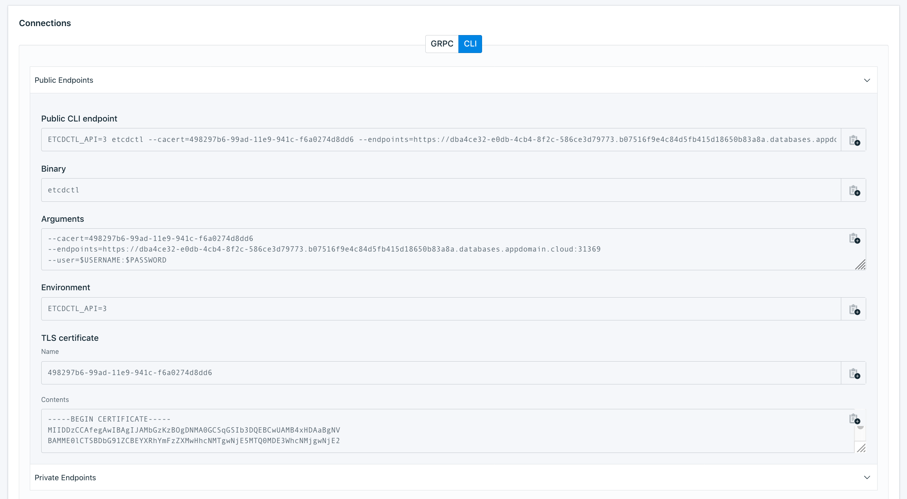

---
copyright:
  years: 2019
lastupdated: "2019-09-17"

subcollection: databases-for-etcd

---

{:shortdesc: .shortdesc}
{:new_window: target="_blank"}
{:codeblock: .codeblock}
{:pre: .pre}
{:screen: .screen}
{:tip: .tip}


# Getting Started Tutorial
{: #getting-started}

This tutorial is a short introduction to using an {{site.data.keyword.databases-for-etcd_full}} deployment.

## Before you begin

- You need to have an [{{site.data.keyword.cloud_notm}} account](https://cloud.ibm.com/registration){:new_window}.

- And a {{site.data.keyword.databases-for-etcd}} deployment. You can provision one from the [{{site.data.keyword.cloud_notm}} catalog](https://cloud.ibm.com/catalog/services/databases-for-etcd). Give your deployment a memorable name that appears in your account's Resource List.

- [Set the Root Password](/docs/services/databases-for-etcd?topic=databases-for-etcd-root-password) for your deployment.

## Connecting with `etcdctl`

Download and install `etcdctl`, which you can get from [the coreos/etcd repository](https://github.com/coreos/etcd/releases/latest). Once it is installed, you can get the formatted connection strings from the deployment's _Dashboard Overview_, in the _Connections_ panel. The _CLI_ tab contains information that a CLI client uses to make a connection to your deployment.



First, save the _contents_ of the TLS certificate to a file and name the file with the TLS certificate _name_. Either save it to the location where you plan on running the `etcdctl` commands or remember where the file is saved so you can provide its full path to the environment variable.

Then, use the values in the _Environment_ and _Arguments_ fields to set up your environment so `etcdctl` can connect and issue commands on your deployment.
```
export ETCDCTL_API=3
export ETCDCTL_CACERT=b179a2b4-b76a-11e9-b9ae-c61492e0d24a
export ETCDCTL_ENDPOINTS=https://156ed317-3aea-4732-a8fd-349c2bb9d39c.bkvfu0nd0m8k95k94ujg.databases.appdomain.cloud:31220
export ETCDCTL_USER=root:password
```

You should now be able to use `etcdctl` to issue commands to your deployment.
```
$ etcdctl put foo bar
OK
$ etcdctl get foo
foo
bar
```

## Using etcd

A good way to get familiar with etcd is to play around with some of its features. This tutorial has a few quick examples on prefixes, transactions, leases, and watchers.

Expanded examples and more features can be found in the [etcd demo](https://etcd.io/docs/v3.3.12/demo/), and more general information on using etcd is in [Interacting with etcd](https://etcd.io/docs/v3.3.12/dev-guide/interacting_v3/).

### Prefixes

etcd stores key-values in a hierarchical system that allows you to store and retrieve information that is nested under layers of keys. 
```
$ etcdctl put /foo-service/container1 examplename
OK
```

Use the `--prefix` option on the get command to query on the top-level directory.
```
$ etcdctl get --prefix /foo-service
/foo-service/container1
examplename
```

If adding more subdirectory keys and values, then the `--prefix` option returns all of them in the top-level directory.
```
$ etcdctl put /foo-service/container2 examplename2
OK
$ etcdctl put /foo-service/container3 examplename3
OK

$ etcdctl get --prefix /foo-service
/foo-service/container1
examplename
/foo-service/container2
examplename2
/foo-service/container3
examplename3
```

### Transactions

Transactions take a series of etcd commands and apply them all as a single, atomic transaction. The `txn` command is broken into three parts.
- Define the key you would like to modify and its value before modifying.
- If the comparison is successful, enter the commands to execute.
- If the comparison is a failure, enter the commands to execute.

If you use interactive mode, `etcdctl txn -i`, the session prompts for the parts.
{: .tip}

```
$ etcdctl put key1 1
OK

$ etcdctl txn -i
# compares:
mod("key1") > "0"
# success requests (get, put, delete):
put key1 "overwrote-key1"
>
>
# failure requests (get, put, delete):
>
>
SUCCESS

OK
```

To check that the new value got assigned to the key,
```
etcdctl get key1
> key1
overwrote-key1
```

### Leases

etcd3 uses leases to manage temporary keys. A lease is created with a time-to-live (TTL) and then attached to a key at creation. One lease can be used for multiple keys. When the TTL on the lease expires, it deletes all associated keys. To create a lease, use grant with a number of seconds for TTL.
```
$ etcdctl lease grant 500
lease 694d5cefe052b00d granted with TTL(500s)
```

Then, create a key/pair with the `--lease` option.
```
$ etcdctl put foo1 bar1 --lease=694d5cefe052b00d
OK
```

You can find out what keys are associated with a granted lease, along with the time remaining on the lease.
```
$ etcdctl lease timetolive 694d5cefe052b00d --keys
lease 694d5cefe052b00d granted with TTL(500s), remaining(377s), attached keys([foo1])
```

After the time on a lease expires, requesting the value of a key does not return anything. If you try to provision a key on a lease that has already expired, it returns an error.
```
$ etcdctl lease grant 10
lease 694d5cefe052b009 granted with TTL(10s)
$ etcdctl put foo1 bar1 --lease=694d5cefe052b009
Error:  etcdserver: requested lease not found
```

### Watchers

Keep track of changes to keys by using the watch command. As an example, running `etcdctl` in one terminal window keeps the connection open and update with any changes to the key that it is watching. Updating the value of the key in a separate terminal displays in both terminals.
```
#Terminal 1
$ etcdctl put greeting 'Hello World'
>Hello World

#Terminal 2
$ etcdctl watch greeting

#Terminal 1
$ etcdctl put greeting 'Hello Watcher'
>Hello Watcher

#Terminal 2
> PUT
greeting
Hello Watcher
```

The connection is left open, and continues to watch that key for subsequent changes.


## Next Steps

If you are just using etcd for the first time, it is a good idea to take a tour through the [etcd documentation](https://etcd.io/docs/v3.3.12/). 

If you are planning to use {{site.data.keyword.databases-for-etcd}} for your applications, check out some of our other documentation pages.
- [Connecting an external application](/docs/services/databases-for-etcd?topic=databases-for-etcd-external-app)
- [Connecting an IBM Cloud application](/docs/services/databases-for-etcd?topic=databases-for-etcd-ibmcloud-app)

Also, to ensure the stability of your applications and your database, check out the pages on 
- [High-Availability](/docs/services/databases-for-etcd?topic=databases-for-etcd-high-availability)
- [Performance](/docs/services/databases-for-etcd?topic=databases-for-etcd-performance)
